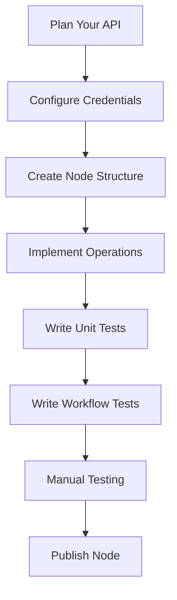

# AGENTS.md - Guide for n8n Node Development

This guide provides complete instructions for developing n8n community nodes using AI (GitHub Copilot, Cursor, Claude, etc.).

## 🚀 Quick Start

To start developing an n8n node:

1. **Read this complete guide** to understand the architecture
2. **Use the AI prompts** in `docs/ai-prompts/` for automated assistance
3. **Follow the best practices** documented here

## 📋 Guide Contents

### [Node Development](./AGENTS.md#node-structure)
- Basic node structure
- Node types (Programmatic, Declarative, Triggers)
- Parameters and configuration
- Versioning and credentials

### [Testing & QA](./ai-prompts/README.md)
- **[Unit Testing](./ai-prompts/UNIT_TESTING.md)** - Unit tests with Jest
- **[Workflow Testing](./ai-prompts/WORKFLOW_TESTING.md)** - Integration tests with workflows
- **[Testing Quick Guide](./ai-prompts/QUICK_GUIDE.md)** - How to use AI to write tests

### [Project Architecture](./ARCHITECTURE.md)
- Directory structure
- Design patterns
- Code best practices

### [Development & Setup](./DEVELOPMENT.md)
- Environment setup
- Development commands
- Debugging and troubleshooting

### [Publishing](./PUBLISHING.md)
- Preparation for publishing
- Release process
- Version maintenance

## 🤖 Available AI Prompts

Specialized prompts for AI are in `docs/ai-prompts/`:

- **[UNIT_TESTING.md](./ai-prompts/UNIT_TESTING.md)** - Prompt for unit test development
- **[WORKFLOW_TESTING.md](./ai-prompts/WORKFLOW_TESTING.md)** - Prompt for workflow test development
- **[QUICK_GUIDE.md](./ai-prompts/QUICK_GUIDE.md)** - Quick guide for AI usage

## 🛠️ Recommended Development Workflow

## 📚 Additional Resources

- [Official n8n Documentation](https://docs.n8n.io/)
- [Community Nodes Guide](https://docs.n8n.io/integrations/community-nodes/)
- [API Reference](https://docs.n8n.io/api/)

---

## Node Structure

Every node implements the `INodeType` interface with:
- `description: INodeTypeDescription` - Node metadata and UI configuration
- `execute?()` - For programmatic nodes
- `poll?()` - For polling triggers (set `polling: true` in description)
- `trigger?()` - For generic triggers
- `webhook?()` - For webhook triggers
- `webhookMethods?` - Webhook lifecycle (checkExists, create, delete)
- `methods?` - loadOptions, listSearch, credentialTest, resourceMapping

## Node Types

### Programmatic Nodes
Use `execute` function for custom logic. Example: `nodes/Discord/v2/DiscordV2.node.ts`

### Declarative Nodes
Use `requestDefaults` and routing configuration instead of `execute`. Example: `nodes/Okta/Okta.node.ts`

### Trigger Nodes
- **Webhook triggers**: Implement `webhook` and `webhookMethods` (checkExists, create, delete). Example: `nodes/Microsoft/Teams/MicrosoftTeamsTrigger.node.ts`
- **Polling triggers**: Set `polling: true` and implement `poll`. Use `getWorkflowStaticData('node')` to persist state. Example: `nodes/Google/Gmail/GmailTrigger.node.ts`
- **Generic triggers**: Implement `trigger` function. Example: `nodes/MQTT/MqttTrigger.node.ts`

## Node Parameters

Common parameter types:
- `string` - Text input
- `options` - Dropdown (static or dynamic via `loadOptionsMethod`)
- `resourceLocator` - Select by list, ID, or URL
- `collection` - Key-value pairs
- `fixedCollection` - Structured collections

Use `displayOptions` to show/hide fields based on other parameters. Use `noDataExpression: true` for resource/operation selectors.

## Versioning

- **Light versioning**: Use version arrays in description: `version: [3, 3.1, 3.2]`
- **Full versioning**: Use `VersionedNodeType` class with separate version implementations. Example: `nodes/Set/Set.node.ts`

## Credentials

Credentials are defined in `credentials/` directory and implement `ICredentialType`:
- `name` - Internal identifier
- `displayName` - Human-readable name
- `properties` - Credential fields
- `authenticate` - Authentication configuration (generic or custom function)
- `test` - Credential test request

Nodes can test credentials via `methods.credentialTest`.

## Testing

### Unit Tests
- Use `jest-mock-extended` for mocking interfaces
- Use `nock` for HTTP mocking
- Mock all external dependencies
- Test happy paths, error handling, edge cases, and binary data

### Workflow Tests
- Use `NodeTestHarness` with JSON workflow definitions
- Mock external APIs with nock
- Use `pnpm test` for running tests. Example: `cd packages/nodes-base/ && pnpm test TestFileName`

## Common Development Tasks

### Creating a New Node
1. Create directory: `nodes/YourService/`
2. Create `YourService.node.ts` implementing `INodeType`
3. Add icon SVG files in node directory
4. Define credentials in `credentials/` if needed
5. Write tests following testing guidelines
6. Register in `package.json` nodes array if needed

### Adding Dynamic Options
Add `loadOptionsMethod` to parameter's `typeOptions` and implement method in `methods.loadOptions`.

### Adding Resource Locator
Change parameter type to `'resourceLocator'`, define modes (list, id, url), add `searchListMethod` for list mode, add `extractValue` regex for URL mode.

## Best Practices

### TypeScript
- Never use `any` type - use proper types or `unknown`
- Avoid type casting with `as` - use type guards instead
- Define interfaces for API responses

### Error Handling
- Use `NodeOperationError` for user-facing errors
- Use `NodeApiError` for API-related errors
- Support `continueOnFail` option when appropriate

### Code Organization
- Separate operation/field descriptions into separate files
- Create reusable API request helpers in GenericFunctions
- Use kebab-case for files, PascalCase for classes

### UI/UX
- Use clear `displayName` and `description` fields
- Set sensible default values
- Use `displayOptions` to show/hide fields conditionally

## Example Nodes

- Declarative: `nodes/Okta/Okta.node.ts`
- Programmatic: `nodes/Discord/v2/DiscordV2.node.ts`
- Webhook Trigger: `nodes/Microsoft/Teams/MicrosoftTeamsTrigger.node.ts`
- Polling Trigger: `nodes/Google/Gmail/GmailTrigger.node.ts`
- Generic Trigger: `nodes/MQTT/MqttTrigger.node.ts`
- Versioned: `nodes/Set/Set.node.ts`
